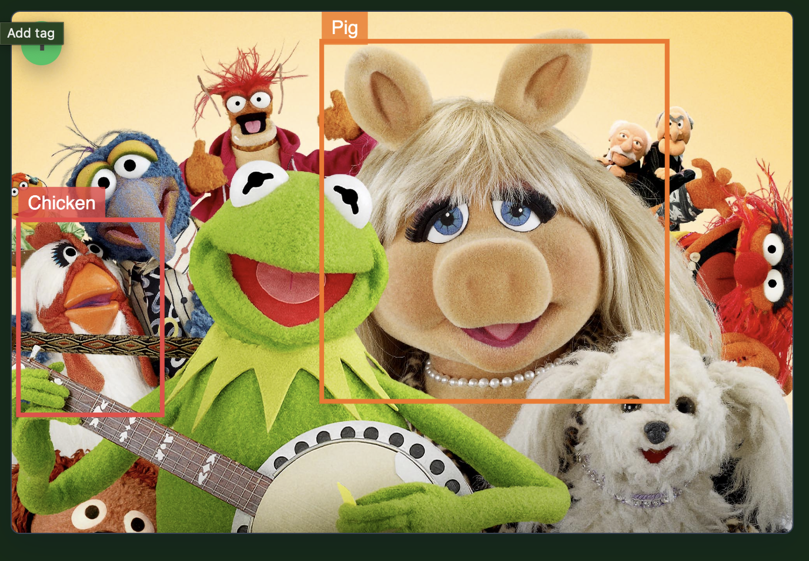

# Bounding Boxes Web Component

`<bounding-boxes>` is a lightweight web component that renders an image and overlays YOLO-format bounding boxes with optional labels. It is designed for tagging and reviewing bounding boxes within browser-based tools, and includes a built-in UI for editing and creating boxes.

## Example

See it in action [here](https://paulcampbell.github.io/bounding-boxes-component/)




## Features

- Render an image onto a canvas with YOLO-format bounding boxes (center X/Y, width, height, all normalized 0–1).
- Visual palette cycling for easy differentiation between boxes.
- Click to select a box; edit labels inline, delete, or cancel edits.
- Keyboard-friendly controls (Enter to save, Escape to cancel).
- Add-tag mode with a dashed drag preview and copy cursor, creating blank labels ready for editing.
- Emits a `boxeschange` event whenever boxes are added, updated, or deleted.
- Optional autosuggest dropdown for labels, including keyboard navigation and type-ahead filtering.

## Getting Started

```bash
npm install
npx http-server ./
```

1. Install dependencies (only needed for building/minifying).
2. Run a static server (e.g. the command above) and open `example.html` to see the component in action.
3. Modify the `boxes` attribute or set the `boxes` property to supply your own data.

## Usage

```html
<script type="module" src="./dist/bounding-boxes.js"></script>

<bounding-boxes
  src="/images/sample.jpg"
  boxes='[
    { "xPosition": 0.5, "yPosition": 0.5, "width": 0.3, "height": 0.2, "label": "bee" }
  ]'
  autosuggestItems='["Bee", "Cat", "Dog"]'
></bounding-boxes>
```

- `src`: Path to the image that should be rendered.
- `boxes`: JSON array of YOLO-format boxes. Each box supports:
  - `xPosition`, `yPosition`: Box centre (0–1).
  - `width`, `height`: Size (0–1).
  - `label`: Optional string rendered above the box.
- `autosuggestItems`: Optional JSON array of strings used to power the type-ahead dropdown when editing labels.

### Events

- `boxeschange`: Fired whenever the internal box collection changes. The event’s `detail.boxes` array reflects the latest component state.

```js
const viewer = document.querySelector('bounding-boxes');
viewer.addEventListener('boxeschange', (event) => {
  console.log('Updated boxes:', event.detail.boxes);
});
```

## Development

Source code lives in `src/bounding-boxes.js`. 

```bash
npm install
npm run build    # produce dist/bounding-boxes.js
npx http-server ./
```

Open `example.html` in the browser.

## Building

This project uses [esbuild](https://esbuild.github.io/) to bundle and minify the component into `dist/bounding-boxes.js`.

```bash
npm run build
```

The build command creates the `dist` folder if needed, bundles the component starting from `src/bounding-boxes.js`, and produces a minified ES module suitable for distribution.
